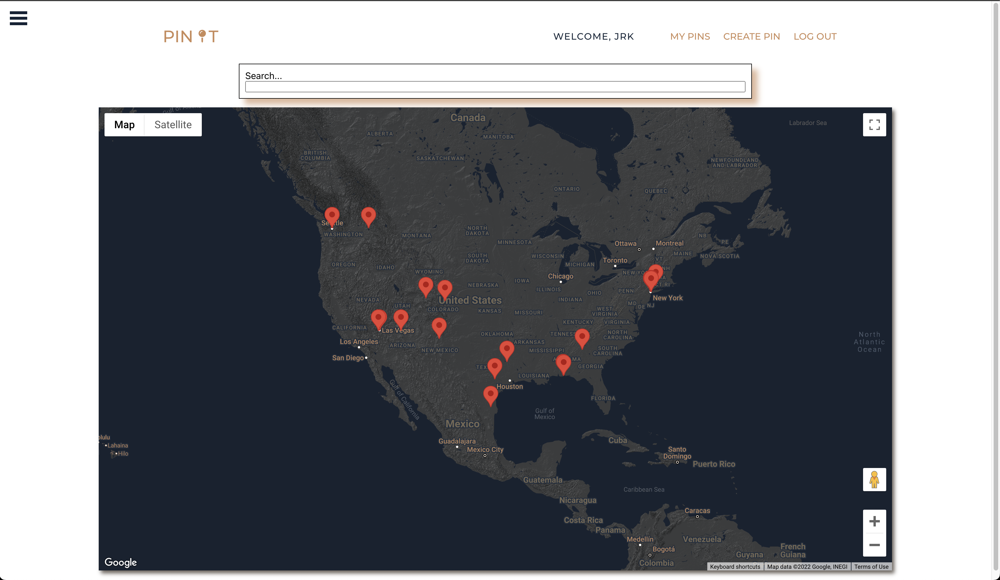
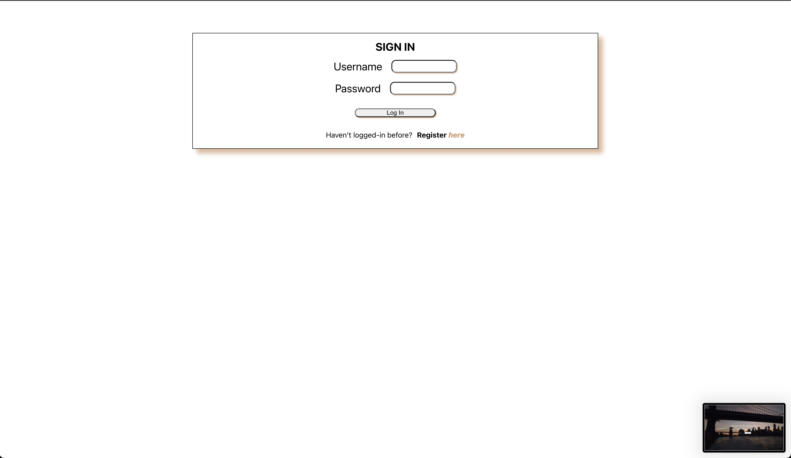
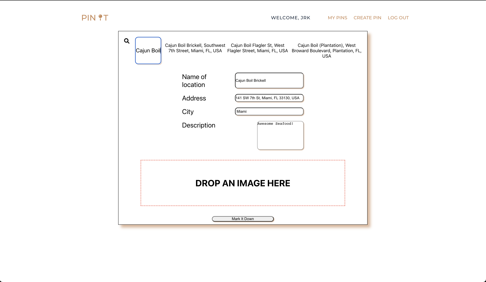
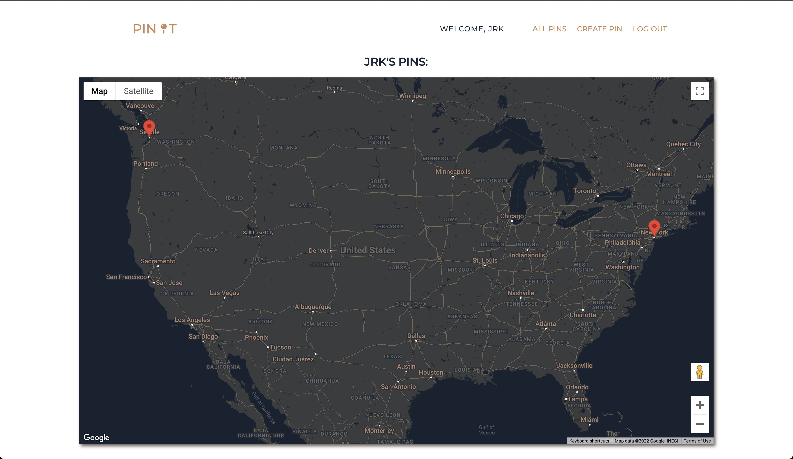
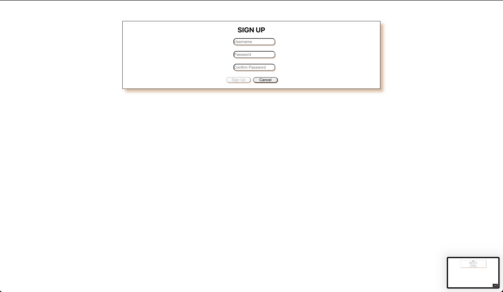

PinIt by JMMZ

### Description

Have you ever planned to travel to a location and want to find the best spots around? 'PinIt' is a social app that utilizes the Google Maps API to allow users to keep a log of their favorite places. Users can place pins for these locations and see where other users have pinned locations. You can add descriptions and images to their pins to personlize them. The Google Maps API allows users to search for specific addresses and also click exactly where they want their pin to be located. 

## Deployed Link:
https://jmmz-ga-p3places-ui.herokuapp.com/

### Brief Example

SCREENSHOTS:

### Features Implemented:

- Token Authorization
- Display maps with User generated pins and rend
- When creating a pin, we implemented a search bar that allows the users to easily search for any address or city all over the globe using the Google Maps Places API
- Sidebar that has a list view of all the pins. (More features for sidebar pending.)
- Navbar updates to show who is currently signed in. 
- Dropbox like feature for uploading images.

 ** List of Technologies Used

JavaScript, HTML, CSS, Node.js, MongoDB Atlas / Mongoose, Image Upload with Cloudinary, bcrypt, axios, JSON Web Token Authorization, Google Maps API (Map, Places, Geocoding), styled components, and React.

 ### Installation Instructions / Getting Started

- Clone down repository.
- Run 'npm i' to install dependencies.

 

If you're having issues loading the map, or other components, be sure to refresh, relogin, and start from the '/' route (the welcome screen)

### GitHub Repository

https://github.com/JMMZ-GA

 

For more info, check out the Frontend README file.